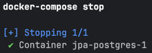
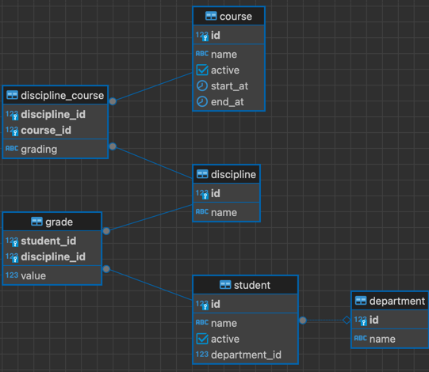

# University Model - JPA

The goal of this task is to practice some major JPA concepts on a Postgres database.

## Description

Your goal is to design database schema and JPA classes to operate with a university model that will include
students, courses, disciplines, and grading.

The task is split into six sections. It's recommended that you complete this task iteratively, section by section;
however, this is not required. You can do it all at once if you prefer.

The instructions below refer to both sections and tasks. Keep in mind that these are the same thing in this context.

You are expected to use a Postgres database.

### How to start a database

First, you need to install Docker and Docker Compose on your local machine.
It'll allow you to run a database instance in an isolated environment.

The easiest way is to install Docker Desktop.
You can follow one of those guides based on your OS:
* Windows - https://docs.docker.com/desktop/setup/install/windows-install/
* Linux - https://docs.docker.com/desktop/setup/install/linux/
* Mac - https://docs.docker.com/desktop/setup/install/mac-install/

After you install Docker, check launch Docker Desktop. It must be up and running.

Go to the project directory using command shell (cmd, bash, zsh, etc.) and execute command:

```bash
docker-compose start
```

If everything is successful, you'll see a message



Now you can connect to the database using the configuration:
* port - 55432
* database - mydatabase
* user - myuser
* password - secret

### SQL scripts

You must provide SQL script(s) that describe your schema. Use the `Flyway` approach to do this.
* You must put your SQL scripts in the `src/main/resources/db/migration` directory.
* Each script must have a `.sql` extension.
* Each script should start with `Vddd__` , where `d` is a digit.

To clarify the last point, if you have multiple scripts, they must be ordered.
This `Vddd` prefix determines this order. So, if you have three scripts, they should be named as follows:
1. `V001__init.sql`
2. `V002__adding_somethig.sql`
3. `V003__changing_something.sql`

`Flyway` supports different ordering formats, but you should stick to the simplest one.

If you have only one script, name it `V001__init.sql`.

However, it's recommended to write multiple scripts to practice making gradual changes to a database.
However, if you feel this is too hard, it's OK to provide just one script for all the changes.

### Java classes

#### JPA

Your work will mostly involve defining JPA entities mapped on your schema.
So, there will be entities and repositories that encapsulate work with database- and JPA-specific classes,
such as `EntityManager` or `EntityManagerFactory`.
All JPA-related classes must go under `edu.epam.fop.web.jpa packages`.

#### Services

However, in some cases, it's wise to implement some functionality on the service layer
instead of writing complex SQL queries. It's up to you to decide what approach you want to use
as long as the requirements are met. Feel free to ask your classmates or professors how best to do this.
All services must go under the `edu.epam.fop.web.service` package.

#### Demos

Also, you'll need to provide demonstration classes (demo-classes).
They will have at least a `main` method, which demonstrates how your code works.
For each section, you'll need to provide at least one demo-class, but there will be more than that in most cases.
All demo classes must go under `edu.epam.fop.web.demos.*` packages. The first section should go in the `task1` sub-package,
the second in `task2`, etc.

If a task says that demo-class accepts some parameter, it means that it'll be passed as a program argument.
You can get them via an args parameter of a main method. For example, if a task says DemoClass accepts name and id,
this class might look like the following:

```java
public class DemoClass {

    public static void main(String[] args) { 
        String name = args[0]; 
        long id = Long.parseLong(args[1]); 

        doWork(name, id); 
    } 

    // there is implementation of doWork 
}
```

## Requirements

### Task 1

First, implement a basic scenario for using JPA.

Create two tables:

1. `student`
    1. id - bigserial primary key
    2. name - varchar
    3. active - boolean
2. `course`
    1. id - bigserial primary key
    2. name - varchar
    3. active - boolean

Create JPA entities for these tables.

Implement CRUD operations for them in repository classes.
This means that using the `StudentRepository` class, it's possible to:

* `C`reate a new student in a database
* `R`ead student(s) from a database
* `U`pdate a student in a database
* `D`elete a student from a database

By default, both students and courses must be inactive.
So, if you create a new student, for example, it must have `active = false`.

When you have completed the task, the files in these directories should be structured as follows:

* edu.epam.fop.web.jpa
    * entity
        * Student
        * Course
    * repository
        * StudentRepository
        * CourseRepository

To demonstrate how your code works, you must implement the following demo classes:

* `CreateCourseDemo` - accepts the name of a course and creates a new course with this name
* `CreateStudentDemo` - accepts the name of a student and creates a new student with this name
* `FindStudentDemo` - accepts a student id and prints it to the console
* `FindCourseDemo` - accepts a course id and prints it to the console
* `ActivateStudentDemo` - accepts a student id and updates its `active` to `true`
* `ActivateCourseDemo` - accepts a course id and updates its `active` to `false`
* `DeleteStudentDemo` - accepts a student id nd deletes it
* `DeleteCourseDemo` - accepts a course id and deletes it

You can find these classes under the `edu.epam.fop.web.demos.task1` package.

### Task 2

In this section, you'll practice using one-to-many relations between entities.

Create a table
1. `department`
    1. id - bigserial primary key
    2. name - varchar

Update the student table by adding a `department_id` column with `bigint` type and references `department(id)`.

For the entities, you need to add a relation between `department` and `student`
using `@OneToMany` and `@ManyToOne` annotations as well as `@JoinColumn`.

For `department`, you must implement a method for creating it. You will treat it as immutable for simplicity's sake,
so no updating or deleting is required.

You need to add methods for:
* Searching for students by department
* Moving a student to a department

By default, a student is created without a department.

Implement demo-classes under the `edu.epam.fop.web.demos.task2` package:
* `CreateDepartmentDemo` - accepts the name of a department and creates a new department with this name
* `MoveStudentToDepartmentDemo` – accepts a student id and department and updates this student `department_id` column to the passed department id.
* `SearchStudentsByDepartmentDemo` - accepts a department id and prints all the students tied to this department to the console

### Task 3

In this section, you'll practice using JPA date-time mapping.

Add the following to the `course` table fields:
1. start_at - timestampz
2. end_at - timestampz

Add methods for updating those columns for a course. By default, they are null.

Here is a business explanation of those fields:

* If a course does not have `start_at`, it's in draft status, so no validation is required.
* If `end_at` is null, it's an infinite course with no deadline.
* If a course has both `start_at` and `end_at`, it must be validated that `end_at` comes after `start_at`.

That means that the active field of a course can be ignored and that `start_at` and `end_at` can be used to determine
if it's active or not. Now, a course is considered active if it has non-null `start_at` in the past
and `end_at` either null or in the future.
If a course's `start_at` is in the future, this course is considered a future course.

Add methods for searching:
* Active courses
* Future courses

Implement demo-classes for task 3:
* `UpdateCourseStartAtDemo` - accepts a course id and a new start_at value and updates it in the database
* `UpdateCourseEndAtDemo` - accepts a course id and a new start_at value and updates it in the database
* `SearchActiveCoursesDemo` - prints all active courses to the console
* `SearchFutureCoursesDemo` - prints all future courses to the console

### Task 4

In this section, you'll practice using many-to-many relations between entities.

Add the table `discipline`:
1. id - bigserial primary key
2. name - varchar

You also need to create a join-table `discipline_course` between course and discipline. It must have the following columns:
1. discipline_id - bigint not null
2. course_id - bigint not null

The primary key for this table is a combination of those columns: `primary key(discipline_id, course_id)`.

Add an entity for discipline and an update course entity. Both must have `@ManyToMany` annotation and reference each other.

Add methods for:
* Creating a discipline
* Deleting a discipline
* Creating a relation between a course and a discipline
* Deleting a relation between a course and a discipline

Keep in mind that if you delete disciplines, the courses tied to them must not be deleted and vice versa.

Implement demo-classes in the `edu.epam.fop.web.demos.task4` package:
* `CreateDisciplineDemo` - accepts a name and creates a new discipline
* `DeleteDisciplineDemo` - accepts an id and deletes a discipline
* `LinkCourseDisciplineDemo` - accepts course and discipline ids and creates a relation between them
* `UnlinkCourseDisciplineDemo` - accepts course and discipline ids and deletes a relation between them
* `SearchDisciplinesForCourseDemo` - accepts a course id and prints all the disciplines tied to this course
* `SearchCoursesOfDisciplineDemo` - accepts a discipline id and prints all courses tied to this discipline

### Task 5

In this task, you'll practice mapping a Java enum to database values.

First, you need to add a column named grading to `discipline_course`. It may be either `varchar` or `int`.
If it's `int`, the default value is 0; otherwise, it's `NONE`.

Declare enum for the values of this column:
* NONE
* EXAM
* TEST
* REPORT

Create an entity for join-table `discipline_course` containing grading column using `@Enumerated` annotation.
`EnumType` should be `ORDINAL` for the `int` grading column and `STRING` for `varchar`.

Add methods for:
* Updating the grading type for the course-discipline relation
* Searching disciplines by course and grading type

Implement demo-classes in the `edu.epam.fop.web.demos.task5` package:
* `UpdatingDisciplineCourseRelationDemo` – accepts a course and discipline id and grading type. It must update the existing relation between course-discipline and grading.
* `SearchDisciplineByCourseAndGradingDemo` - accepts a course id and grading and prints to the console all disciplines that are tied to the course and have the passed grading

### Task 6

In this task, you will practice using transient fields in JPA and bean validation (JSR-380).

Add the table `grade`:
1. student_id - bigint not null references `student(id)`
2. discipline_id - bigint not null references `discipline(id)`
3. value - int null. Allowed values: from 0 to 100 inclusive

Add methods for:
* Adding a relation between student and discipline and grading
* Updating this relation
* Deleting this relation

Create a JPA entity for `Grade`. On the `value` field, add `@Min` and `@Max` annotations.

Update `student` with a `@OneToMany` field for `grade`. Add a `@Transient` field for average grade.
This must be updated in the `grades` setter.

Keep in mind that a student's average grade must be calculated only in Java code and not persisted in the database in any way.

Implement demo-classes in the `edu.epam.fop.web.demos.task6` package:
* `AddingOrUpdatingGradeDemo` – accepts a student id, discipline id, and int value for grading and updates or creates a relation between discipline and student
* `DeletingGradeDemo` – accepts a student id and discipline id and deletes the relation between them.

### Final Schema

In the end, your schema should look like:


